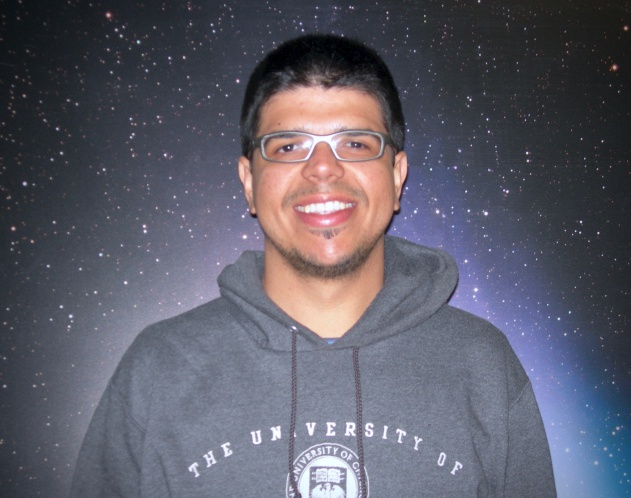

{: style="text-align:center"}

I am a PhD candidate at the Geneva Observatory, where I work with Prof. [David Ehrenreich](https://obswww.unige.ch/~ehrenrei/homepage/Welcome.html) and many other scientists. I am also a member of the [NCCR PlanetS](http://nccr-planets.ch) collaboration.

My main research topic is the detection and characterization of extra-solar planets, more specifically the dynamics and chemistry of their upper atmospheres. I am also interested in solving problems related to the observation and description of stellar atmospheres and developing scientific software for the astronomical community. The main instruments I use in my research are high-resolution and/or space-based spectrographs, and a trusty MacBook Pro.

---

My full list of publications can be found on [ADS](http://adsabs.harvard.edu/cgi-bin/nph-abs_connect?db_key=AST&db_key=PRE&qform=AST&arxiv_sel=astro-ph&arxiv_sel=cond-mat&arxiv_sel=cs&arxiv_sel=gr-qc&arxiv_sel=hep-ex&arxiv_sel=hep-lat&arxiv_sel=hep-ph&arxiv_sel=hep-th&arxiv_sel=math&arxiv_sel=math-ph&arxiv_sel=nlin&arxiv_sel=nucl-ex&arxiv_sel=nucl-th&arxiv_sel=physics&arxiv_sel=quant-ph&arxiv_sel=q-bio&sim_query=YES&ned_query=YES&adsobj_query=YES&aut_logic=AND&obj_logic=OR&author=dos+santos%2C+leonardo+a.&object=&start_mon=&start_year=&end_mon=&end_year=&ttl_logic=OR&title=&txt_logic=OR&text=&nr_to_return=200&start_nr=1&jou_pick=ALL&ref_stems=&data_and=ALL&group_and=ALL&start_entry_day=&start_entry_mon=&start_entry_year=&end_entry_day=&end_entry_mon=&end_entry_year=&min_score=&sort=SCORE&data_type=SHORT&aut_syn=YES&ttl_syn=YES&txt_syn=YES&aut_wt=1.0&obj_wt=1.0&ttl_wt=0.3&txt_wt=3.0&aut_wgt=YES&obj_wgt=YES&ttl_wgt=YES&txt_wgt=YES&ttl_sco=YES&txt_sco=YES&version=1). Here are some highlights:

* L. A. dos Santos, V. Bourrier, D. Ehrenreich, S. Kameda, 2019, [Observability of hidrogen-rich exospheres in Earth-like exoplanets](http://adsabs.harvard.edu/abs/2018arXiv181202145D), A&A 622.

* R. B. Botelho, A. C. Milone, J. Meléndez, et al. 2019, [Thorium in solar twins: implications for habitability in rocky planets](http://adsabs.harvard.edu/abs/2019MNRAS.482.1690B), MNRAS 482.

* J. Meléndez, M. Bedell, J. L. Bean, et al. 2017, [Close-in, low-mass planet candidates and evidence of planet accretion in the solar twin HIP 68468](http://adsabs.harvard.edu/abs/2017A%26A...597A..34M), A&A 597.

* L. A. dos Santos, J. Meléndez, J.-D. do Nascimento, et al. 2016, [The Sun as a typical rotator and evidence for a new rotational braking law for Sun-like stars](http://adsabs.harvard.edu/abs/2016A%26A...592A.156D), A&A 592.

You can also look me up on <a href="https://orcid.org/0000-0002-2248-3838" target="orcid.widget" rel="noopener noreferrer" style="vertical-align:top;">orcid.org/0000-0002-2248-3838</a> and <a href="https://scholar.google.com/citations?user=qtgZdFIAAAAJ">Google Scholar</a>.

---

Occasionally I [write software](https://github.com/ladsantos) in Python and random scripts for astronomical research. Here are some that I think could be useful for other people:

* [`radial`](https://github.com/ladsantos/radial): Pure Python code for working with radial velocities of stars with a  companion (checkout the tutorial notebooks [here](https://github.com/ladsantos/RV_PS2017)).

* [`sunburn`](https://github.com/ladsantos/sunburn): Data analysis package of HST far-UV spectra. **Feature requests are very welcome!** (shoot me an email or [post an issue](https://github.com/ladsantos/sunburn/issues))

* [`onza`](https://github.com/ladsantos/onza): Transiting exospheres (work in progress)

* [ESO unpack](https://github.com/ladsantos/ESO_unpack): Did you just download dozens of GBs of data from ESO's archive? This script can help you unpack the data.

---

I wrote summaries of interesting astronomical articles for [Astrobites](https://astrobites.org) between 2015 and 2017. Here are some of my favorite posts:

* [Adventures in watchmaking for cool stars](https://astrobites.org/2017/07/03/adventures-in-watchmaking-for-cool-stars/)

* [A neutron star in the Eye of Sauron?](https://astrobites.org/2017/03/24/a-neutron-star-in-the-eye-of-sauron/)

* [Strength in numbers: a smarter way to find habitable worlds](https://astrobites.org/2017/05/23/strength-in-numbers-a-smarter-way-to-find-habitable-worlds/) (also featured on [AAS NOVA](http://aasnova.org/2017/07/18/strength-in-numbers-a-smarter-way-to-find-habitable-worlds/))

* [The impact of the Physics GRE in astronomy graduate school admissions](https://astrobites.org/2016/09/09/the-impact-of-the-physics-gre-in-astronomy-graduate-admissions/)