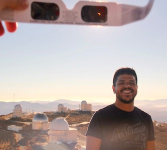

{: style="text-align:center"}

I am a PhD candidate at the Geneva Observatory, where I work with [David Ehrenreich](https://obswww.unige.ch/~ehrenrei/homepage/Welcome.html) and many other scientists. I am also a member of the [NCCR PlanetS](http://nccr-planets.ch) collaboration.

My main research topic is the detection and characterization of extra-solar planets, more specifically their upper atmospheres. I am also interested in solving problems related to the observation and description of stellar atmospheres and developing scientific software for the astronomical community. The main instruments I use in my research are high-resolution and/or space-based spectrographs.

---

My full list of publications can be found on [ADS](https://ui.adsabs.harvard.edu/search/q=author%3A%22dos%20Santos%2C%20L.%20A.%22%20AND%20database%3Aastronomy&sort=date%20desc%2C%20bibcode%20desc&p_=0). Here are some highlights:

* L. A. dos Santos, D. Ehrenreich, V. Bourrier, et al. 2020, [The high-energy environment and atmospheric escape of the mini-Neptune K2-18 b](https://ui.adsabs.harvard.edu/abs/2020A%26A...634L...4D/abstract), A&A Letters 634.

* L. A. dos Santos, D. Ehrenreich, V. Bourrier, et al. 2020, [Search for helium in the upper atmosphere of the hot Jupiter WASP-127 b using Gemini/Phoenix](https://ui.adsabs.harvard.edu/abs/2020A%26A...640A..29D/abstract), A&A 640.

* D. Lorenzo-Oliveira, J. Meléndez, Yana Galarza, J. et al. 2019, [Constraining the evolution of stellar rotation using solar twins](https://ui.adsabs.harvard.edu/abs/2019MNRAS.485L..68L/abstract), MNRAS 482.

* L. A. dos Santos, J. Meléndez, J.-D. do Nascimento, et al. 2016, [The Sun as a typical rotator and evidence for a new rotational braking law for Sun-like stars](https://ui.adsabs.harvard.edu/abs/2016A%26A...592A.156D/abstract), A&A 592.

You can also look me up on <a href="https://orcid.org/0000-0002-2248-3838" target="orcid.widget" rel="noopener noreferrer" style="vertical-align:top;">orcid.org/0000-0002-2248-3838</a> and <a href="https://scholar.google.com/citations?user=qtgZdFIAAAAJ">Google Scholar</a>.

---

Occasionally I [write software](https://github.com/ladsantos) in Python and random scripts for astronomical research. Here are some that I think could be useful for other people:

* [`radial`](https://github.com/ladsantos/radial): Pure Python code for working with radial velocities of stars with a companion (checkout the tutorial notebooks [here](https://github.com/ladsantos/RV_PS2017)).

* [`sunburn`](https://github.com/ladsantos/sunburn): Data analysis package of HST far-UV spectra.

* [`onza`](https://github.com/ladsantos/onza): Exospheres in transmission spectroscopy.

* [ESO unpack](https://github.com/ladsantos/ESO_unpack): Did you just download dozens of GBs of data from ESO's archive? This script can help you unpack the data.

---

I wrote summaries of interesting astronomical articles for [Astrobites](https://astrobites.org) between 2015 and 2017. Here are some of my favorite posts:

* [Adventures in watchmaking for cool stars](https://astrobites.org/2017/07/03/adventures-in-watchmaking-for-cool-stars/)

* [A neutron star in the Eye of Sauron?](https://astrobites.org/2017/03/24/a-neutron-star-in-the-eye-of-sauron/)

* [Strength in numbers: a smarter way to find habitable worlds](https://astrobites.org/2017/05/23/strength-in-numbers-a-smarter-way-to-find-habitable-worlds/) (also featured on [AAS NOVA](http://aasnova.org/2017/07/18/strength-in-numbers-a-smarter-way-to-find-habitable-worlds/))

* [The impact of the Physics GRE in astronomy graduate school admissions](https://astrobites.org/2016/09/09/the-impact-of-the-physics-gre-in-astronomy-graduate-admissions/)